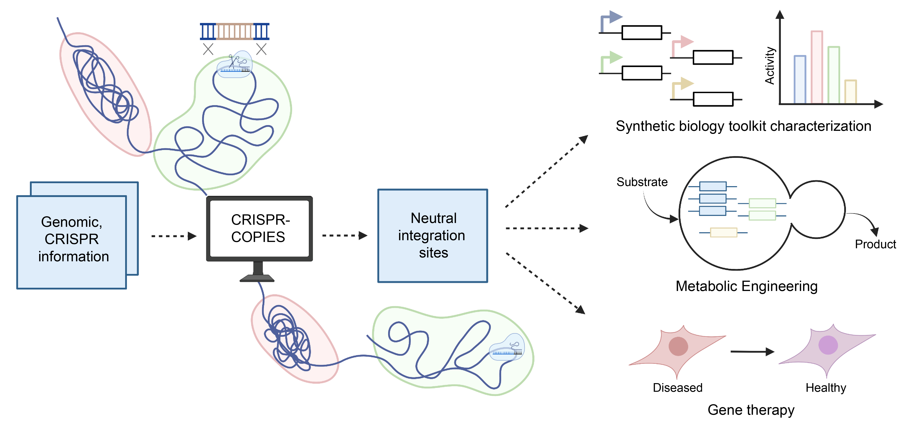

# CRISPR-COPIES
**CO**mputational **P**ipeline for the **I**dentification of CRISPR/Cas-facilitated int**E**gration **S**ites (`CRISPR-COPIES`) is a user-friendly web application and a command line tool for rapid discovery of neutral integration sites. Designed to work for any organism with a genome in NCBI and for any CRISPR system, `CRISPR-COPIES` can identify neutral sites in a genome-wide manner. The identified sites can be used for characterization of synthetic biology toolkits, rapid strain construction to produce valuable biochemicals, and human gene and cell therapy.



### THE PAPER!
This repository accompanies the work ["CRISPR-COPIES: An in silico platform for discovery of neutral integration sites for CRISPR/Cas-facilitated gene integration"](https://www.biorxiv.org/content/10.1101/2023.09.06.556564v1.abstract).

### Web Application & Google Colab
You can use `CRISPR-COPIES` through our web interface. Visit us at [CRISPR-COPIES](https://biofoundry.web.illinois.edu/copies/). You can also run the code on Google Colab by following these steps: 
1. Upload `COPIES.ipynb`, 
2. Clone the repository, 
3. Follow the instructions to download BLAST, install the necessary packages, and run the command line tool for your organism/strain of interest. 

Note: We have restricted the web interface to prokaryotic and small eukaryotic genomes. We advise you to use our command line option for genomes greater than 120 Mb in size as significant time and computation resources are required. 

### Command Line Tool on Linux

- [Installation](#installation)
- [Usage](#usage)
- [Documentation](#documentation)

### Installation
```
bash setup.sh
```
### Usage

`CRISPR-COPIES` can also be accessed using the command line. First, activate the environment using
```
source venv38/bin/activate
```
For information on the parameters, run
```
python code/main.py -h
```
A sample example to run the script - 
```
python code/main.py -g ../data/s288c/GCF_000146045.2_R64_genomic.fna -t ../data/s288c/GCF_000146045.2_R64_feature_table.txt -p NGG -o 3prime -l 20 -sl 10 --edit_dist 6 --intspace 350 -out ../data/s288c/output.csv --distal_end_len 10000 -hr_l 50 --protein_file ../data/s288c/GCF_000146045.2_R64_protein.faa --blast_org 'Saccharomyces cerevisiae' -n 4
```

Utilizing more processors (n >= 4) is recommended for faster BLAST operations.

To create an interactive visualization of the output, run  -
```
python code/create_viz.py
```
If you want to run CRISPR-COPIES with on-target model for E. coli, update the following packages -
```
pip install numpy==1.23.1 scikit_learn==1.1.1 sklearn-pmml-model==1.0.0
```

### Documentation
Detailed information and sample values of parameters for different organisms is provided [here](https://biofoundry.web.illinois.edu/copies/docs).


### Reference
<details>
<summary>If you use this tool, please cite us:</summary>

```bibtex
Boob, Aashutosh Girish, et al. "CRISPR-COPIES: An in silico platform for discovery of neutral integration sites for CRISPR/Cas-facilitated gene integration." bioRxiv (2023): 2023-09.
```
</details>
